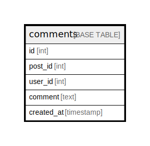

# comments

## Description

<details>
<summary><strong>Table Definition</strong></summary>

```sql
CREATE TABLE `comments` (
  `id` int NOT NULL AUTO_INCREMENT,
  `post_id` int NOT NULL,
  `user_id` int NOT NULL,
  `comment` text NOT NULL,
  `created_at` timestamp NOT NULL DEFAULT CURRENT_TIMESTAMP,
  PRIMARY KEY (`id`),
  KEY `post_id@comments` (`post_id`),
  KEY `post_id-created_at@comments` (`post_id`,`created_at`),
  KEY `user_id@comments` (`user_id`)
) ENGINE=InnoDB AUTO_INCREMENT=[Redacted by tbls] DEFAULT CHARSET=utf8mb4 COLLATE=utf8mb4_0900_ai_ci
```

</details>

## Columns

| Name | Type | Default | Nullable | Extra Definition | Children | Parents | Comment |
| ---- | ---- | ------- | -------- | ---------------- | -------- | ------- | ------- |
| id | int |  | false | auto_increment |  |  |  |
| post_id | int |  | false |  |  |  |  |
| user_id | int |  | false |  |  |  |  |
| comment | text |  | false |  |  |  |  |
| created_at | timestamp | CURRENT_TIMESTAMP | false | DEFAULT_GENERATED |  |  |  |

## Constraints

| Name | Type | Definition |
| ---- | ---- | ---------- |
| PRIMARY | PRIMARY KEY | PRIMARY KEY (id) |

## Indexes

| Name | Definition |
| ---- | ---------- |
| post_id-created_at@comments | KEY post_id-created_at@comments (post_id, created_at) USING BTREE |
| post_id@comments | KEY post_id@comments (post_id) USING BTREE |
| user_id@comments | KEY user_id@comments (user_id) USING BTREE |
| PRIMARY | PRIMARY KEY (id) USING BTREE |

## Relations



---

> Generated by [tbls](https://github.com/k1LoW/tbls)
